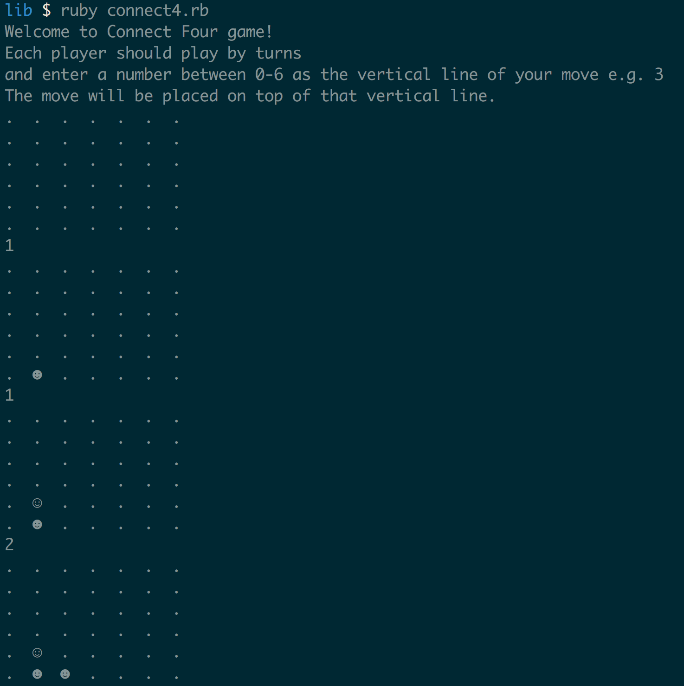
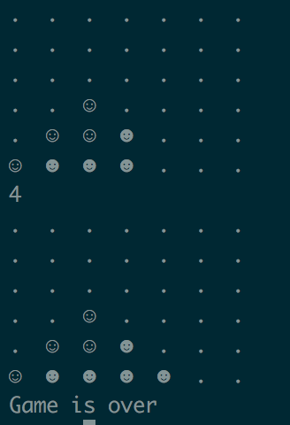
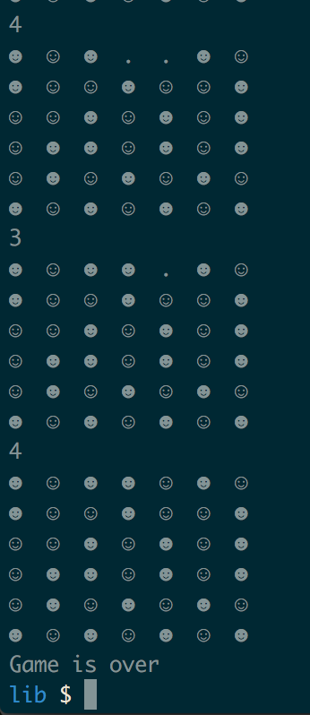

## TDD Style Project

[Connect Four](http://en.wikipedia.org/wiki/Connect_Four) is a basic game where each player takes turns dropping pieces into the cage. Players win if they manage to get 4 of their pieces consecutively in a row, column, or along a diagonal.

The game rules are fairly straightforward and it is built on the command line like the other games. To spice up the game pieces, the [unicode miscellaneous symbols](http://en.wikipedia.org/wiki/List_of_Unicode_characters#Miscellaneous_Symbols).

### When the game starts

### When the player wins

### When the player loses

